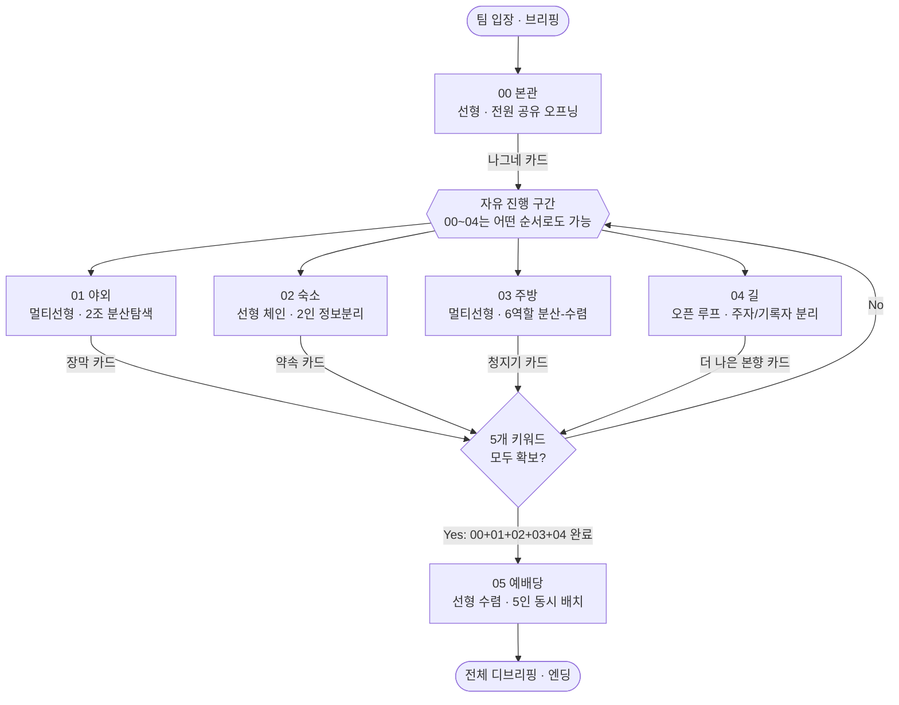

# 본향 사건파일 — 완전 재설계 청사진 (승인용)

작성: Claude(기획 총괄) · 대상: PM 승인권자 · 목적: 구현 착수 전 최종 승인
필수 입력 문서: `ESCAPE_ROOM_RESEARCH.md`, `REVIEW_FUN_AND_MATERIALS.md` (본 문서 전체에서 근거로 인용)
전제: 대학생 5인 팀 × 5팀 동시 진행, 총 세션 150분, 6개 스테이지(00~05)

이 문서는 계획 문서다. 승인 전까지 `game.js`/`game.html`/`activity.*`/`dashboard.*`/`stage-packets/*`/기존 기획 문서는 수정하지 않는다. 승인 후 §11의 단계별 실행계획에 따라 별도 작업으로 반영한다.

---

## 0. 문서 사용법

- §1은 "지금 무엇이 진짜 문제인가"에 대한 결정이다. 표로 정리된 항목은 협상 대상이 아니라 확정된 판단이다.
- §2~§9는 재설계된 게임 자체의 명세다. 구현 담당은 이 명세를 그대로 옮기면 된다.
- §10은 이 명세가 실제로 통했는지 확인하는 방법이다.
- §11은 "누가 무엇을 언제 만드는가"이다.
- 인용은 `[번호]`로 표기하고, 최초 등장 시 원문 URL을 괄호로 병기한다. 번호는 `ESCAPE_ROOM_RESEARCH.md` §0의 참고문헌 번호와 동일하다.

---

## 1. 결정적 진단 — 무엇을 버리고 무엇을 남기는가

### 1.1 먼저 밝혀야 할 것: 두 입력 문서 이후 이미 바뀐 것

`ESCAPE_ROOM_RESEARCH.md`와 `REVIEW_FUN_AND_MATERIALS.md`는 필수 입력이지만, 이 문서를 쓰기 위해 실제 `game.js`(현재 HEAD, 커밋 `c9c72cf`)를 다시 읽은 결과 두 문서가 지목한 결함 중 **두 가지는 이미 고쳐져 있다** (커밋 `583eca7 Integrate redesigned stage 00 and stage 05 gameplay`). 근거를 숨기지 않고 그대로 보고한다 — 오래된 메모리나 문서 내용을 검증 없이 재추천하지 않기 위함이다.

| 문서가 지목한 결함 | 문서 작성 시점 주장 | 현재 코드 실측 (`game.js`) | 판정 |
|---|---|---|---|
| 05 자동 채움 | `localStorage`에서 값이 자동으로 채워져 확인 버튼만 누름 | `renderHomePuzzle()`(game.js:567~655): 입력창은 비어 있고(`value` 속성 없음), `normalize()` 비교로 5단어를 직접 입력해야 하며, 통과 후 `phase:"physical"`에서 실물 상자를 열어야 완료됨 | **이미 해결됨** — 다만 "실물 인터록"이 버튼 클릭 하나뿐이라는 다음 결함이 남음(§1.4) |
| 00 단어 입력 하나 | `renderCasePuzzle()`이 문장 하나 읽고 단어 하나 입력하는 구조 | `renderCasePuzzle()`(game.js:159~) : 5개 기록 중 거짓 3개를 선택해야 정체성 입력창이 열리는 대조 퍼즐이 이미 구현됨 | **이미 해결됨** — 유지, 실물 단서 부재만 보강 필요(§1.4) |

이 두 항목은 §1.2(유지)로 재분류한다. 두 연구 문서의 **원칙과 근거([1]~[15])는 여전히 전부 유효**하며, 아래 §1.3·§1.4는 이 원칙에 비추어 **여전히 남아 있는** 결함만 다룬다.

### 1.2 유지 (건드리지 않는다)

| 대상 | 유지 이유 |
|---|---|
| 03 주방 전체 구조(`renderInventoryPuzzleV2`, `stage-packets/stage-03.md`) | 6종 역할 카드로 분산-수렴을 실제 구현한 유일한 스테이지 [10](https://dl.acm.org/doi/10.1145/3064663.3064767)[15](https://www.escapereality.com/blog/escape-rooms-for-large-teams). 위치·문장·권한 3근거 교차확인은 "단서 2종 이상 대조" 원칙의 모범 사례. 5팀 독립 키트 운영안까지 문서화됨. **이 프로젝트의 기준선이다.** |
| 00 본관의 5기록 대조 인터랙션 | 회상이 아니라 관찰·대조로 이미 재구성됨. 세계관 진입 스테이지로서 선형 구조가 맞음(온보딩에는 선형이 허용됨 [1]). |
| 05 예배당의 "수동 입력 후 실물 상자" 골격 | 해법 단계를 숨기지 않는다는 원칙 준수. 다만 실물 단계 자체가 아직 얕음(§1.4에서 보강). |
| 02 숙소의 4단계 포렌식 흐름(알림→암호→사진 3장 대조→메모 복원) | 이미 "휴대폰 알림(단서1) + 문 앞 안내문(단서2, 실물 전용)"으로 분리되어 있다. 관리자 미리보기 코드를 보면 문 앞 안내문 정보가 일반 플레이 화면에는 노출되지 않아, 실제로 실물 카드 없이는 못 푼다 — 설계 원칙 2.3/2.4를 이미 만족. |
| 04 길의 루프-반전 구조(편한 선택=제자리로 복귀) | 방탈출다운 긴장감이 실제로 구현된 유일한 반전 퍼즐. `REVIEW_FUN_AND_MATERIALS.md` §1도 재미있는 요소로 꼽음. |
| 00~04 자유 진행 / 05 선행조건 게이트 아키텍처 | `finalPrerequisitesComplete` 체크(game.js:77)가 이미 정확히 구현되어 있음. |

### 1.3 폐기 — 이미 구현되어 있어도 삭제한다

| # | 대상 | 위치 | 폐기 이유 |
|---|---|---|---|
| D1 | 스테이지 키워드 사전 노출 | `index.html` 148~183행 venue-grid: `01 장막`, `02 약속`, `03 청지기`, `04 더 나은 본향` 카드가 미플레이 상태에서 그대로 노출 | 추리할 필요를 시작 전에 없앤다. "Ask Why" 관점에서 존재 이유가 없는 스포일러 [4](http://scottnicholson.com/pubs/askwhy.pdf). 원칙 2.1/2.10 정면 위반. **즉시 삭제, 대체 문구로 교체(§9.4)**. |
| D2 | 01 야외의 무보상 구조 | `renderFieldPuzzle()`(game.js:295~313) | `unlock()` 호출이 없다. 유일하게 도전-해법-보상 3요소 중 보상이 통째로 빠진 스테이지 [1][2]. 화면이 그냥 "봉투를 열고 활동 페이지로 돌아가라"는 안내로 끝난다 — 성공 확인 자체가 없다. **이 함수는 폐기하고 §3.2 사양으로 재작성한다.** |
| D3 | 01의 단일 단서 유형 구조 | `renderFieldPuzzle()` 전체 | 표식 4개 숫자를 순서대로 찾는 것 하나뿐이다. 서로 대조할 두 번째 단서 유형이 없어 "회상형 스캐빈저 헌트"에 머문다. 원칙 2.4(단서 2종 이상 대조) 위반. **미끼 표식 + 판별 단서를 신설(§3.2)해 대체한다.** |
| D4 | dashboard.js 03 힌트2 데이터 | `dashboard.js` 41~44행 | "부족한 품목은 쌀, 빵, 소금, 부족분 4-3-2"는 실제 게임(밀·기름·소금, 수량 계산 없음, `432`는 선반 번호)과 다르다. 라이브 세션에서 진행자가 이 힌트를 읽으면 팀에게 오답을 유도한다. **즉시 §7의 검증된 문구로 교체.** |
| D5 | dashboard.js 00 힌트2가 정답을 직접 노출 | `dashboard.js` (case 항목 hint2: "정답은 나그네입니다") | `ESCAPE_ROOM_DESIGN_PRINCIPLES.md` 2.8이 스스로 "나쁜 힌트: 정답은 0316입니다"를 금지 예시로 들면서, 정작 대시보드 힌트가 같은 실수를 반복한다 [8](https://roomescapeartist.com/2019/10/24/escape-room-hint-systems/). **§7의 3단계 힌트로 전면 교체.** |
| D6 | admin-games.js의 01 제목 불일치 | `admin-games.js` 3행: `title: "가짜 안식처"` | `game.js`/`script.js`/`activity.js`/`GAME_PM_BOARD.md`는 전부 "너무 오래 머문 자리"다. 관리자 화면만 다른 이름을 쓰면 리허설 중 운영자가 스테이지를 오인한다. **삭제 후 통일.** |
| D7 | 전 스테이지 공용 QR 토큰 1개(`rodem-2026`) | `config.js` 3행, `script.js` | 첫 QR을 스캔한 순간 주소창에 토큰이 노출되고, 이후 `?stage=` 파라미터만 바꾸면 현장에 가지 않고 모든 스테이지를 열 수 있다. `activity.js` 174행의 "직접 주소 입력으로는 게임이 열리지 않습니다"라는 안내와 실제 동작이 정면으로 다르다. **스테이지별 개별 토큰 체계로 폐기·대체(§9.2).** |
| D8 | 05의 "확인 버튼 하나"짜리 실물 단계 | `renderHomePuzzle()` `phase:"physical"` 블록(game.js:582~600) | 웹 5단어 입력은 이미 고쳐졌지만, 그 뒤 실물 단계가 "실제 최종 상자를 열었다" 버튼 클릭 하나뿐이다. 5명이 카드를 들고 동시에 모여야 하는 신체적 클라이맥스가 아직 코드로도 소품으로도 존재하지 않는다. 세션 전체에서 가장 몸을 많이 움직여야 할 3분이 지금은 버튼 하나다. **신규 고백보드 인터록(§3.6)으로 대체한다.** |
| D9 | 04의 단일 진행자 조작 구조 | `renderLoopPuzzleV2()` (game.js:527~) | 한 사람이 화면 앞에서 선택지를 계속 눌러도 완결된다. 팀 내부 분산-수렴 지점이 명시적으로 강제되지 않는다. **주자/기록자 역할 분리를 신설(§3.5)해 보강한다.** |

### 1.4 재건 (구조는 살리되 다시 만든다)

| 대상 | 무엇을 재건하는가 |
|---|---|
| 00 본관 | 인터랙션은 유지하되, **실물 현장 단서가 전혀 없다**는 결함을 보강한다. 현재는 전부 화면 안에서 끝나 원칙 2.3(현장 단서 최소 1개) 위반이다. 실물 사건 안내 현판 + 진술서 카드를 신설한다(§3.1). |
| 01 야외 | §1.3 D2·D3 폐기 후 §3.2 사양으로 전면 재작성. |
| 05 예배당 | §1.3 D8 폐기 후 §3.6 고백보드 인터록으로 재건. |
| 04 길 | 핵심 반전은 유지, §3.5의 주자/기록자 역할 분리와 5팀 동선 계획을 추가. |
| GAME_PM_BOARD.md 준비물 표 | 5팀 기준 수량은 있으나 §3의 신규 소품(관찰기록표, 미끼표식, 사건 현판, 고백보드 등)이 빠져 있다. §6에서 전면 재계산. |

### 1.5 신규 (지금 없는 것을 만든다)

- 01: 미끼 표식 + 관찰기록표(진위 판별용 2차 단서)
- 00: 실물 사건 현판 + 진술서 카드(현장 단서 신설)
- 04: 주자/기록자 역할 카드, 이중 루프 경로(동선 병목 해소)
- 05: 고백보드 슬라이딩 인터록(지그재그 키 조각 방식)
- 전 스테이지: 00·01·02·04·05용 표준 5역할 카드(03은 기존 6역할 유지)
- QR: 스테이지별 개별 토큰 발급 체계
- game.css: 성공/실패 트랜지션 애니메이션 1세트(0.6~1초, 진동/사운드 훅 포함)

---

## 2. 새 프리미스 · 스토리 바이블 · 플레이어 프로미스

기존 세계관(히브리서 11장 "나그네"·"본향" 순례자 서사)은 프로젝트명(`본향 사건파일`)과 6개 스테이지 전체 문서·코드에 이미 깊이 박혀 있고, 신학적 메시지 자체가 이 활동의 존재 이유다. 이를 갈아엎는 것은 "다른 프로젝트를 새로 만들자"는 것과 같다. 따라서 이 문서가 말하는 "새 프리미스"는 **내용 교체가 아니라 서사 건축(Narrative Architecture)의 재설계**다 [4]. 지금까지는 세계관이 스테이지마다 파편적으로 설명되어 있었다. 아래는 하나의 결정된 스토리 바이블이다.

### 2.1 장르 결정

**현장 수사극(Case File Procedural)**. 참가자는 "사라진 조사팀의 흔적을 좇는 후속 조사팀"이다. 성경 지식 퀴즈가 아니라, 실종 사건을 재구성하는 형사 역할극이다. 정답은 신앙적이어도 되지만, 도달하는 방식은 끝까지 관찰-대조-추리여야 한다(원칙 2.6, 2.7).

### 2.2 로그라인

> "이 시설에 먼저 들어온 조사팀은 도착하지 않은 것으로 기록되어 있다. 그들이 남긴 다섯 개의 흔적은 그들이 실종된 게 아니라, 다른 곳으로 옮겨졌다고 말한다. 당신의 팀은 그 다섯 흔적을 따라가 마지막 방에서 그들이 어디로 갔는지 알게 된다 — 그리고 그 답은 당신의 팀에게도 해당된다."

### 2.3 세계관 규칙 (Ask Why 통과 기준)

모든 소품·화면·힌트는 다음 질문에 답할 수 있어야 스테이지에 포함된다 [4]:
1. 이것은 사라진 조사팀이 실제로 남겼을 법한 물건/기록인가?
2. 이것이 없으면 참가자가 특정 추론 단계를 건너뛸 수 있는가? (그렇다면 필수 단서)
3. 이것을 없애도 서사가 어색하지 않은가? (그렇다면 "이스케이프룸 로직"이므로 삭제)

### 2.4 플레이어 프로미스 (참가자에게 암묵적으로 약속하는 것)

- **이 방은 정답을 미리 보여주지 않는다.** (D1 삭제로 실제로 지킨다)
- **모든 팀원이 각 현장에서 최소 한 번은 다른 사람이 갖지 못한 정보를 쥔다.** (§3 전 스테이지 역할 카드로 보장)
- **자물쇠가 열리는 순간은 확인 버튼이 아니라 실제 사건이다.** (§9.3 트랜지션, §3.6 고백보드)
- **오답은 벌이 아니라 세계관의 반응이다.** (§8.1 실패 피드백)
- **마지막 방은 새 문제가 아니라 지금까지의 답이다.** (§3.6)

### 2.5 톤 & 보이스 규칙

- 문어체 단서 문장은 종결어미를 "-다/-이다"로 통일(현재 코드와 일치, 유지).
- 힌트 문구는 절대 답을 직접 말하지 않는다(§1.3 D5로 확인된 위반을 전 스테이지에서 재검사).
- 실패 문구는 "틀렸습니다"를 쓰지 않는다. 세계관 안의 인물(장부 담당, 룸메이트, 기록자 등)의 반응으로 대체한다(기존 대부분 스테이지가 이미 이 규칙을 따름 — 계속 유지).

---

## 3. 00~05 스테이지 아키텍처

각 스테이지는 다음 11개 항목을 모두 명시한다: 목표 / 스토리 비트 / 플레이어 행동 / 단서 유형(최소 2종) / 아하 모먼트 / 물리적 상호작용 / 웹 상호작용 / 산출물 / 키워드 / 완료 조건. 역할 카드는 5인 팀 기준(4·6인 가감 규칙은 각 스테이지 하단에 병기).

### 3.1 00 본관 — "도착하지 않은 조사팀" (유지 + 실물 단서 신설)

| 항목 | 내용 |
|---|---|
| 목표 | 세계관 진입, "대조를 통해 모순을 찾는다"는 전 스테이지 공통 패턴을 프라이밍 [5](https://roomescapeartist.com/2020/10/21/priming-puzzles-escape-rooms/) |
| 스토리 비트 | 접수대 기록에는 조사팀이 "미도착"으로 남아 있다. 사건번호 `H-11-13`이 반복 등장하지만 아무도 그 의미를 설명하지 않는다. |
| 플레이어 행동 | 2인은 실물 진술서 카드 5장을 나눠 읽고, 1인은 접수대 벽면의 실물 사건 현판을 확인하고, 2인은 웹의 5개 기록 그리드를 조작해 거짓 3건을 선택한다. |
| 단서 유형 1(웹) | 사건 메모 4행(접수시각/상태/위치/목적지)과 5개 디지털 기록 카드 |
| 단서 유형 2(실물, 신규) | 접수대 실물 현판: "사건번호 H-11-13", "11:13은 도착 시각이 아니라 기록을 여는 위치다"라는 문구가 웹과 동일하게 인쇄되어 있다. 참가자는 실물 현판 문구와 웹의 5개 기록을 대조해야 어떤 기록이 "시각"을 "도착 시각"으로 오용했는지(거짓 판정 근거) 알 수 있다. |
| 아하 모먼트 | "11:13은 시각이 아니라 위치"라는 반전과 동시에, "미도착=아직 길 위"라는 표현이 참가자 자신의 팀 상태와 겹쳐진다는 자각 |
| 물리적 상호작용 | 접수대 실물 현판 확인, 진술서 카드 5장을 손으로 넘기며 2인이 소리 내어 대조 |
| 웹 상호작용 | 5개 기록 중 거짓 3개 선택(체크) → 정체성 한 단어 입력 |
| 산출물 | 실물 키워드 카드 "나그네"(05로 휴대), 완료 코드 `PILGRIM-00` |
| 키워드 | 나그네 |
| 완료 조건 | 거짓 기록 3건 정확 선택 + 정체성 단어 정확 입력 → 실물 카드 지급 |
| 역할 카드(5인) | 현판 판독 1 / 진술서 낭독 2 / 웹 대조 조작 1 / 시간 관리·최종 발표 1 |

### 3.2 01 야외 시설 — "너무 오래 머문 자리" (전면 재건)

| 항목 | 내용 |
|---|---|
| 목표 | 첫 실물 자물쇠 성공 경험을 프라이밍 락으로 제공 [5], "편안함=거짓 안식처"라는 주제를 몸으로 체험 |
| 스토리 비트 | 조사팀은 편한 자리마다 표식을 남기고 너무 오래 머물렀다. 그중 일부 표식은 나중에 온 다른 사람이 남긴 미끼다. |
| 플레이어 행동 | 팀을 2개조로 나눠 마당 양쪽에서 각 2개 표식씩 수색 → 모여서 진짜/미끼를 판별 → 순서대로 자물쇠 입력 |
| 단서 유형 1(웹) | "그늘 아래 오래 머문 자리 / 둘이 앉지만 한 방향을 보는 자리 / 무게가 놓인 낮은 자리 / 다시 갈라지는 자리" 4개의 시적 위치 힌트(기존 문구 유지) |
| 단서 유형 2(실물, 신규) | 관찰기록표: 진짜 표식 뒷면에만 있는 작은 십자 스탬프, 미끼 표식(장소별 1~2개 추가 배치)에는 그 스탬프가 없다. 참가자는 숫자를 발견한 순서가 아니라 "스탬프가 있는 표식만" 골라야 진짜 4자리를 얻는다. |
| 아하 모먼트 | 처음엔 숫자만 있는 줄 알았다가, 미끼 표식 때문에 "그럴듯해 보이는 것"과 "실제로 표시된 것"을 구별해야 한다는 걸 깨닫는 순간 — 원칙 2.3의 "그냥 보면 장식처럼 보인다"를 실현 |
| 물리적 상호작용 | 표식 4개(+미끼 2~3개) 수색, 4자리 자물쇠 봉투 개방 |
| 웹 상호작용 | 읽는 순서 안내 → **신규: 자물쇠 개방 확인 화면**(성공 트랜지션 + `TENT-01` 코드 확인 버튼, `unlock()` 호출) |
| 산출물 | 실물 키워드 카드 "장막", 완료 코드 `TENT-01` |
| 키워드 | 장막 |
| 완료 조건 | 진짜 표식 4개를 순서대로 입력해 자물쇠 개방 + 웹 확인 화면에서 코드 확인 |
| 역할 카드(5인) | 동쪽 수색 2 / 서쪽 수색 2 / 관찰기록표 대조·자물쇠 조작 1 |

### 3.3 02 숙소 — "잠긴 휴대폰" (유지, 역할 명문화)

| 항목 | 내용 |
|---|---|
| 목표 | 정체성과 욕망을 드러내는 조사, 00에서 배운 "대조" 패턴을 재사용(프라이밍 회수) |
| 스토리 비트 | 방주인의 휴대폰이 잠겨 있고, 문 앞에는 이름표 두 개와 약속 카드 수령 기록이 남아 있다. |
| 플레이어 행동 | 화면 담당 1인은 잠금화면 알림 2개만 읽고, 실물 안내문 담당 1인은 문 앞 카드만 보며, 둘이 말로만 정보를 교환해 `0316`을 도출한다. |
| 단서 유형 1(웹 전용) | 잠금화면 알림 2개("약속한 날은 문 앞에 있다" / "비밀번호는 MMDD") — 실물에는 없음 |
| 단서 유형 2(실물 전용) | 문 앞 안내문: 약속 카드 수령일 `03/16`, 임시 이름표 2장, 퇴실 안내 `11:13` — 웹 일반 화면에는 노출되지 않음(관리자 미리보기 전용, 기존 구현 유지) |
| 아하 모먼트 | 이름표(성공한 사람/인정받는 사람)는 버려야 할 가짜 정체성이고, 진짜로 붙든 것은 "약속"이었다는 반전 |
| 물리적 상호작용 | 문 앞 실물 안내문 확인 및 구두 전달 |
| 웹 상호작용 | 잠금해제(`0316`) → 사진 3장 상태도장 대조 → 원본 선택 → 메모 복원 |
| 산출물 | 실물 키워드 카드 "약속", 완료 코드 `PROMISE-02` |
| 키워드 | 약속 |
| 완료 조건 | `0316` 해제 + 사진 원본 정확 선택 + 메모 마지막 줄 복원 |
| 역할 카드(5인) | 화면 담당 1(알림 전용) / 안내문 담당 1(실물 전용, 화면 못 봄) / 사진 감식 2 / 메모 복원 발표 1 |

### 3.4 03 주방 및 기타 시설 — "맡겨진 것을 바꾼 사람" (그대로 유지)

`stage-packets/stage-03.md` 전체를 승인된 명세로 그대로 채택한다. 6종 역할(수색A/B, 보관 복원, 기록 감식, 권한 확인, 반증·발표), 위치·문장·권한 3근거 교차확인, 자물쇠 `432`, 완료 코드 `STEWARD-03`은 변경하지 않는다. 유일한 변경은 §7의 진행자 힌트 데이터 오류 수정이다(코드 변경 없음, 대시보드 데이터만 수정).

### 3.5 04 비아 돌로로사 — "돌아갈 수 있었던 길" (역할 분리 신설)

| 항목 | 내용 |
|---|---|
| 목표 | 가장 방탈출다운 메인 퍼즐. 반복·기억·방향 자물쇠 조작을 실전 적용(00→04, 01→04 프라이밍 회수) |
| 스토리 비트 | 편하고 익숙한 선택은 계속 제자리로 돌아온다. 좁고 낯선 선택만 앞으로 나아간다. |
| 플레이어 행동 | 주자 1~2인이 물리적으로 표시된 4개 지점(A문/B눈/C발자국/D별)을 순서대로 이동하며 장면 카드를 읽고, 기록자 1인이 베이스에서 웹을 조작하며 주자의 구두 설명만으로 선택지를 확정한다. 나머지는 문장 조각 정렬과 방향 자물쇠 조작을 준비한다. |
| 단서 유형 1(실물) | 4개 지점에 부착된 장면 카드(기억 담당의 증언 텍스트) — 오직 현장에서만 읽을 수 있다 |
| 단서 유형 2(웹) | 루프 기록과 문장 조각 보드 — 주자가 전달한 정보를 기록자가 여기에 입력해야 진행된다 |
| 아하 모먼트 | "쉬운 선택=제자리 복귀"라는 반복을 몸으로 겪은 뒤, 문장을 맞추면 방향이 `오른쪽→위→왼쪽→위`로 뒤집혀 읽힌다는 재해석 |
| 물리적 상호작용 | 현장 이동 + 방향 자물쇠 조작 |
| 웹 상호작용 | 루프 선택 4회, 문장 조각 정렬 |
| 산출물 | 실물 키워드 카드 "더 나은 본향", 완료 코드 `BETTER-04` |
| 키워드 | 더 나은 본향 |
| 완료 조건 | 루프 4회 통과 + 문장 정렬 정확 + 방향 자물쇠 개방 |
| 역할 카드(5인) | 주자 2(현장 이동 전담, 서로 못 보는 지점 담당 가능) / 기록자 1(웹 전담) / 문장 조각 정렬 1 / 방향 자물쇠 조작 1 |
| 5팀 동선 | 물리 경로가 병목이므로 **거울대칭 이중 경로(A라인/B라인)**를 마련한다. 홀수 팀은 A라인, 짝수 팀은 B라인에서 시작해 서로 마주치지 않게 한다(§5, §6 참고). |

### 3.6 05 예배당 — "예비된 성" (메타 퍼즐, 실물 인터록 신설)

| 항목 | 내용 |
|---|---|
| 목표 | 회수. 00~04의 키워드·정보가 새 맥락에서 재해석되어야 한다(재수집 금지 [6]). |
| 스토리 비트 | 다섯 흔적이 하나의 순례로 이어진다: 나그네였던 이들이 장막에 거하며 약속을 바라보고 청지기로 살다가 더 나은 본향을 사모했다. |
| 플레이어 행동 | 전원이 각자 들고 온 키워드 카드를 웹에서 먼저 수동으로 입력해 순서 논리를 확인한 뒤, 5명 전원이 동시에 고백보드 앞에 모여 각자 카드를 정해진 슬롯에 꽂는다. |
| 단서 유형 1(웹) | 5개 입력창(자동 채움 없음, 기존 구현 유지) — 팀원들이 서로 기억을 맞대야 채워짐 |
| 단서 유형 2(실물, 신규) | 고백보드: 슬롯 5개가 히브리서 11장 순서(나그네→장막→약속→청지기→더 나은 본향)로 고정되어 있고, 각 카드는 지그재그 모양의 키 조각으로 재단되어 **정해진 슬롯에만 물리적으로 들어간다**. 5장이 모두 올바른 슬롯에 꽂히면 보드 뒷면의 슬라이딩 바가 풀리며 최종 상자의 자물쇠 셔틀이 노출된다. |
| 아하 모먼트 | "히브리서 11장의 흐름이 곧 우리가 오늘 겪은 순서였다"는 재해석 — 단순히 답을 다시 모으는 게 아니라 순서 자체가 새 의미를 갖는 순간 [6] |
| 물리적 상호작용 | 5명 동시 카드 배치(세션 유일의 전원 동시 물리 협력 지점) → 슬라이딩 바 해제 → 최종 상자(`1116`) 자물쇠 개방 |
| 웹 상호작용 | 5단어 입력 확인 → `phase:"physical"` 안내 → "실제 최종 상자를 열었다" 확인 → 귀향 선언문 생성 |
| 산출물 | 화면/출력용 귀향 선언문, 최종 완료 코드 `HOMEWARD-05` |
| 키워드 | 예비된 성 |
| 완료 조건 | 웹 5단어 정확 입력 + 고백보드 5장 정확 슬롯 배치(인터록 해제 관찰) + 실물 상자 개방 확인 |
| 역할 카드(5인) | 각자 자신이 획득한 키워드 카드의 "소유자"가 되어 해당 슬롯 배치를 전담(5명 모두 필수 참여, 대리 불가) |

---

## 4. 퍼즐 의존성 · 흐름 매트릭스

경로 유형 분류는 Nicholson(2015)/Wiemker et al.(2015)의 선형(Linear)/오픈(Open)/멀티선형(Multi-Linear) 정의를 따른다 [1][2].

### 4.1 스테이지 내부 경로 유형

| 스테이지 | 경로 유형 | 분산 지점 | 수렴 지점 |
|---|---|---|---|
| 00 | 선형(허용된 온보딩) | 진술서 5장을 2인이 나눠 읽음 | 거짓 3건 합의 후 정체성 입력 |
| 01 | 멀티선형 | 마당 동/서 2조가 각 2표식씩 독립 수색 | 관찰기록표 대조 후 순서 합의 |
| 02 | 선형 체인(정보 분리형) | 화면 담당 vs 안내문 담당이 각자 다른 단서 보유 | 구두 교환 후 `0316` 도출 |
| 03 | 멀티선형(기준선) | 6역할이 각기 다른 자료 소유 | 3근거 교차 후 지목 |
| 04 | 오픈 루프 | 주자(현장) vs 기록자(웹)가 물리적으로 분리 | 문장 조각 정렬 시 재합류 |
| 05 | 선형 수렴(전원 필수) | — (전 단계에서 이미 분산된 카드 소유) | 5인 동시 배치 |

### 4.2 5인 팀 분산-수렴 지점 요약

세션 전체에서 "누구도 할 일이 없는 시간이 없어야 한다"는 원칙 [10][15]을 지키기 위해, 6개 스테이지 모두 최소 1개의 분산 지점을 갖도록 설계했다(00~04는 §3의 역할 카드, 05는 전원 필수 참여). 03만 예외적으로 6역할(4~6인 가감)을 유지한다.

---

## 5. 150분 런오브쇼 (5팀 동시 진행)

| 시간대 | 길이 | 전체 진행 | 팀 배치 |
|---|---:|---|---|
| 0:00–0:10 | 10분 | 체크인, 팀 편성(5인×5팀=25명), 역할 카드 배부 안내 | 로비 집결 |
| 0:10–0:15 | 5분 | 세계관 브리핑(로그라인 낭독), 규칙 안내("정답은 알려주지 않는다") | 로비 |
| 0:15–0:35 | 20분 | **00 본관 공동 오프닝**: 5팀을 3분 간격으로 스태거 입장(00은 좁은 공간이라 동시 5팀 투입 시 병목) | 팀별 3분 간격 순차 입장 |
| 0:35–2:00 | 85분 | **자유 진행 구간**: 01/02/03/04를 팀이 원하는 순서로 진행. 04는 A/B 이중 경로로 홀짝 배정 | 각 스테이지 5팀 동시 수용(독립 키트) |
| 2:00–2:25 | 25분 | **05 예배당 수렴**: 팀은 완료 순서대로 자연 도착. 진행자가 대시보드로 대기열 관리(동시 2팀까지 보드 배치 가능하도록 고백보드 2세트 운용 권장) | 완료 순 입장 |
| 2:25–2:30 | 5분 | 사진 촬영 및 마무리 | 예배당 |

합계: 150분. 04의 이중 경로와 00의 스태거 입장은 §6·§8에서 구체화한다.

### 5.1 여유 시간 설계

- 85분 자유 구간 안에서 팀당 4개 스테이지(01·02·03·04) 평균 배분은 21.25분/스테이지. §7의 목표 소요(15~25분) 상단과 거의 일치하므로, 힌트 캡(스테이지당 최대 2회)을 넘기는 팀은 진행자가 §8.2의 "시간 초과 자동 통과 카드"를 발동해 05 수렴 시간을 지킨다.
- 00(20분: 3분 스태거×5팀+15분 최장 플레이 여유)과 05(25분)는 고정 블록이라 자유 구간이 밀려도 전체 150분은 유지된다.

---

## 6. 실물 소품 · 인쇄물 (팀별 정확 수량, 5팀 기준)

### 6.1 스테이지별 신규/변경 소품

| 스테이지 | 품목 | 5팀 기준 수량 | 비고 |
|---|---|---:|---|
| 00 | 실물 사건 현판(A5, 접수대 고정) | 1개(공용, 팀별 아님) | **신규** — 현장 단서 최초 확보 |
| 00 | 진술서 카드 5장/팀 | 25장 | 기존 웹 5기록과 내용 동일 실물화 |
| 00 | 역할 카드 4종/팀 | 20장 | 신규(§3.1) |
| 01 | 진짜 표식(십자 스탬프 포함) 4개/팀 | 20개 | 기존 유지 |
| 01 | 미끼 표식(스탬프 없음) 2~3개/팀 | 10~15개 | **신규** |
| 01 | 관찰기록표(진위 판별 안내) 1장/팀 | 5장 | **신규** |
| 01 | 4자리 자물쇠 봉투(`2741`) | 5개 | 기존 유지 |
| 01 | 역할 카드 3종/팀 | 15장 | 신규(§3.2) |
| 02 | 문 앞 안내문 세트(약속카드/이름표2/퇴실안내) | 5세트 | 기존 유지, 5팀분 수량 확정 |
| 02 | 역할 카드 4종/팀 | 20장 | 신규(§3.3) |
| 03 | `stage-packets/stage-03.md` §4 전체 | 그대로 | 변경 없음 |
| 04 | 장면 카드 4종(A~D) × 2경로(A/B라인) | 40장 | A라인 20 + B라인 20(거울대칭) |
| 04 | 방향 자물쇠 봉투 | 5개 | 기존 유지 |
| 04 | 역할 카드 4종/팀 | 20장 | 신규(§3.5) |
| 05 | 고백보드(지그재그 슬롯 5개 + 슬라이딩 인터록) | 2세트(대기열 완화용) | **신규 제작 필요, 목공/아크릴** |
| 05 | 최종 상자(`1116` 자물쇠) | 5개 | 고백보드 2세트에 맞춰 상자는 5개 유지, 보드만 순환 사용 가능 |
| 05 | 귀향 선언문 서식 | 5부 | 기존 유지 |

### 6.2 공통 준비물 (전 스테이지 공통)

| 품목 | 수량 | 비고 |
|---|---:|---|
| 4자리 번호 자물쇠 | 10개(01용 5 + 05 예비 5) | |
| 3자리 번호 자물쇠 | 5개 | 03용, 변경 없음 |
| 4방향 자물쇠 | 5개 | 04용 |
| QR 출력물(스테이지별 개별 토큰) | 6종 × 최소 2매(스테이션당 원본+예비) = 12장 | §9.2 토큰 정책 반영 |
| 클립보드 | 5개 | 팀별 |
| 팀 표식(A~E) 스티커 세트 | 5세트 | 전 소품에 부착 |
| 진행자 통합 정답표(§8.3) | 2부(플로팅 진행자 2인분) | **신규** |
| 힌트 1~3단계 운영 카드 | 스테이지당 1세트 × 2부 | §7 |
| 시간 초과 자동 통과 카드 | 스테이지당 5장(팀별 1장) | **신규**, §8.2 |

---

## 7. 3단계 힌트 스크립트 · 난이도 예산

힌트 캡: **스테이지당 최대 2회 요청**, 트리거는 "팀 요청 + 진행자 재량"의 혼합형, 무진행 4분 초과 시 진행자가 선제적으로 힌트 1을 제안한다 [8]. 힌트 문구는 어떤 단계에서도 최종 숫자/단어를 그대로 말하지 않는다(§1.3 D5 위반 재발 방지).

| 단계 | 목표 소요 | 힌트 없이 완주 목표 |
|---|---|---|
| 00 | 12~15분 | 70% 이상 |
| 01 | 15~20분 | 70% 이상 |
| 02 | 15~18분 | 60% 이상 |
| 03 | 15~20분 | 60% 이상 |
| 04 | 18~25분(의도적 최난도) | 50% 이상 |
| 05 | 18~25분 | 60% 이상(메타지만 급격히 어려워지면 안 됨) |

### 00 본관
1. 시선: "다섯 기록 중 시각과 위치를 말하는 기록을 나란히 놓아 보십시오."
2. 대조: "사건 메모의 네 사실과 각 기록을 하나씩 대조하십시오. 어긋나는 기록끼리 공통점이 있습니다."
3. 행동: "'미도착'과 '아직 길 위' 표현만 남기고, 그 사람을 부르는 한 단어를 정체성 칸에 넣으십시오."

### 01 야외
1. 시선: "그늘, 함께 앉는 자리, 낮은 무게, 길목 순서로 가되, 처음 보이는 숫자가 전부 진짜는 아닙니다."
2. 대조: "관찰기록표의 표시가 있는 표식만 진짜입니다. 미끼와 하나씩 대조하십시오."
3. 행동: "표시가 있는 표식 네 개를 발견한 순서대로 자물쇠에 입력하십시오."

### 02 숙소
1. 시선: "알림 두 개를 모두 펼쳐 자료와 형식을 확인하십시오."
2. 대조: "숙소 문 앞 기록에서 '약속한 날'을 찾아 형식(MMDD)에 맞춰 보십시오."
3. 행동: "사진 세 장은 반복 횟수가 아니라 '임시/원본' 상태 도장을 비교해 원본을 고르십시오."

### 03 주방 (기존 `stage-packets/stage-03.md` §9 그대로 채택, 변경 없음)
1. "카드가 발견된 곳과 원래 있어야 할 곳은 다를 수 있습니다. 먼저 여섯 장을 원본 안내도대로 복원하십시오."
2. "조작된 기록에는 같은 두 단서가 반복됩니다. '먼저 처리'라는 문장과 그 문장을 쓴 담당자를 권한표에서 확인하십시오."
3. "소금, 기름, 밀 카드를 매트에서 찾고, 웹의 표식 순서대로 선반 번호를 읽으십시오."

### 04 길
1. 시선: "쉬운 선택은 늘 제자리로 돌아옵니다. 주자는 낯설고 좁은 선택지를 다시 보십시오."
2. 대조: "네 지점의 증언을 문장 네 조각과 하나씩 맞춰 보십시오. 조각마다 작은 방향 표식이 있습니다."
3. 행동: "문장을 완성한 순서대로 방향 표식을 읽어 자물쇠에 입력하십시오."

### 05 예배당
1. 시선: "다섯 현장에서 얻은 카드를 팀원 각자 확인하십시오. 순서는 아직 정해지지 않았습니다."
2. 대조: "나그네가 무엇을 하며 살았는지 순서를 떠올려 보십시오 — 머물고, 바라보고, 맡은 것을 지키고, 떠났습니다."
3. 행동: "웹에서 순서를 확인한 뒤, 같은 순서로 고백보드 슬롯에 카드를 꽂으십시오."

---

## 8. 실패 · 복구 · 진행자 운영

### 8.1 오답 시 세계관 반응 (기존 문구 유지 + 04·05 보강)

| 스테이지 | 실패 피드백 |
|---|---|
| 00 | "기록끼리 서로 증언하는 시간이 맞지 않습니다." |
| 01 | "편한 곳에서 멈추면 길은 이어지지 않습니다." (미끼 표식 선택 시: "그 표식에는 아무 표시도 없습니다.") |
| 02 | "이 번호는 주인이 보여주고 싶었던 모습에 가깝습니다. 숨긴 기록을 더 보십시오." |
| 03 | (`stage-03.md` §8 그대로) "발견 장소만으로 판단하지 마십시오. 원래 선반, 문장, 권한이 모두 어긋나는지 확인하십시오." |
| 04 | "익숙한 길은 빠르지만, 같은 자리로 돌아왔습니다." |
| 05 | "단어는 맞지만 순례의 순서가 흐트러졌습니다." (고백보드 오배치 시: 카드가 물리적으로 슬롯에 들어가지 않음 — 이 자체가 피드백) |

### 8.2 시간·정체 관리

- **무진행 4분 초과** → 진행자가 선제적으로 힌트 1단계 제안 [8].
- **시간 초과 자동 통과 카드**(진행자 전용, 팀에게 노출 금지): 85분 자유 구간이 끝나갈 때 특정 팀이 특정 스테이지에 묶여 있으면, 진행자가 해당 카드를 제시해 즉시 완료 코드와 키워드 카드를 지급하고 다음으로 넘긴다 [11][12]. 사용 시 대시보드에 기록해 사후 난이도 재조정 근거로 삼는다.
- **04 동선 병목**: A/B 이중 경로 사용, 홀짝 팀 배정. 동시 3팀 이상 대기 시 진행자가 다음 팀을 01/02로 유도.
- **00 스태거 입장**: 3분 간격 5팀 순차 투입으로 접수대 혼잡 방지.
- **05 대기열**: 고백보드 2세트 운용, 대시보드에서 완료 임박 팀을 미리 파악해 진행자가 사전 안내.

### 8.3 진행자 정답표(요약 — 대시보드 §9.3의 근거 데이터)

| 스테이지 | 정답/코드 | 비고 |
|---|---|---|
| 00 | 거짓 기록: stampA/deskC/numberD, 정체성: 나그네, 코드 `PILGRIM-00` | |
| 01 | 진짜 표식 4개(스탬프 순서), 자물쇠 `2741`, 코드 `TENT-01` | |
| 02 | 잠금 `0316`, 원본사진 `promise`, 코드 `PROMISE-02` | |
| 03 | 조작품목 소금/기름/밀, 범인 배급 담당, 자물쇠 `432`, 코드 `STEWARD-03` | `stage-03.md` §12와 동일 |
| 04 | 선택 순서 leave/remember(=narrow)/unseen, 방향 오른쪽→위→왼쪽→위, 코드 `BETTER-04` | |
| 05 | 슬롯 순서 나그네→장막→약속→청지기→더 나은 본향, 상자 `1116`, 코드 `HOMEWARD-05` | |

### 8.4 소품 파손·분실 대응

- 표식/카드류는 스테이지당 예비 1세트를 별도 보관(§6에 반영된 수량은 운영분, 예비분은 +10%로 추가 발주).
- 자물쇠 조합 분실 시 진행자 정답표(§8.3)로 즉시 재설정.
- 04 고백보드 인터록이 물리적으로 걸리는 경우, 진행자가 슬라이딩 바를 수동 해제할 수 있는 백도어 나사를 보드 뒷면에 둔다(참가자 노출 금지).

---

## 9. 웹 상태 · QR · 활동 페이지 · 대시보드 요구사항

### 9.1 스테이지 상태 모델 (기존 `loadPuzzleState`/`savePuzzleState` 패턴 유지, 신규 스테이지에도 동일 적용)

- 00: `{selected:[], contradictionsConfirmed, solved}` (변경 없음)
- 01: `{found:[], order:[], decoyAttempts:0, solved}` (신규 필드: 미끼 선택 시도 카운트 — 진행자 대시보드용)
- 02: `{notices:[], unlocked, photos:[], original, memo, solved}` (변경 없음)
- 03: `stage-packets/stage-03.md` §8 그대로
- 04: `{phase, index, loops, history, fragments, slots, interpretation, solved}` (변경 없음)
- 05: `{phase:"assemble"|"physical"|"complete", teamName, solved}` (변경 없음, 자동 채움 절대 금지 유지)

### 9.2 QR/토큰 정책 (D7 대체)

- 스테이지별 개별 토큰 6종 발급(`case-XXXX`, `bag-XXXX` 등 형태). 하나의 토큰을 알아도 다른 스테이지 URL을 유효하게 만들 수 없다.
- `config.js`의 단일 `qrToken` 필드를 스테이지별 매핑 객체로 교체.
- `activity.js`의 "직접 주소 입력으로는 게임이 열리지 않습니다" 문구는 이 정책이 실제로 구현된 뒤에만 유지한다. 구현 전까지는 문구를 "QR을 스캔해야 이 현장의 게임이 열립니다"로 완화해 실제 동작과 불일치를 없앤다.
- 세션(행사 회차)마다 토큰을 회전할 수 있도록 `config.js`를 행사 날짜별로 분리 관리.

### 9.3 game.html 성공/실패 트랜지션 (신규)

- 모든 `unlock()` 호출 지점에 0.6~1초 화면 전환(색상 변화 + 짧은 문구 페이드인)을 추가. 가능하면 `navigator.vibrate()`로 짧은 진동을 함께 트리거(모바일 한정, 미지원 브라우저는 무시).
- 01의 `renderFieldPuzzle()`은 이 트랜지션과 `unlock()` 호출을 반드시 포함해야 D2가 해소된 것으로 인정한다.

### 9.4 activity.html / index.html

- `index.html` venue-grid에서 D1(키워드 사전 노출)을 제거하고, 각 카드는 "완료 코드는 현장에서 확인" 문구로 통일(00 카드가 이미 쓰는 패턴을 01~05에도 적용).
- `activity.js`의 스테이지 소개문에 §3의 역할 카드 배정 안내를 1줄씩 추가(예: "화면 담당과 안내문 담당을 나누십시오").

### 9.5 dashboard.js

- D4(03 힌트 데이터 오류), D5(00 힌트 정답 노출)를 §7의 검증된 힌트 문구로 교체.
- 힌트 사용 여부/횟수를 팀별로 기록하는 필드를 유지·강화해 §10 플레이테스트 지표(힌트 사용률 50% 기준)를 실측할 수 있게 한다.
- 01의 미끼 선택 시도 횟수(9.1 신규 필드)를 대시보드에 표시해 진행자가 정체 팀을 조기 파악.

### 9.6 admin-games.js

- D6(01 제목 불일치) 수정: `"가짜 안식처"` → `"너무 오래 머문 자리"`.

---

## 10. 플레이테스트 프로토콜 · 측정 가능한 pass/fail 기준

### 10.1 3단계 검증

| 단계 | 방식 | 통과 기준 |
|---|---|---|
| A. 데스크 워크스루 | 기획 문서만으로 진행자가 각 스테이지를 처음부터 끝까지 손으로 시뮬레이션 | 모든 스테이지에서 정답이 단서 2종 대조 없이 찍어서 나오지 않음을 확인 |
| B. 소규모 실물 파일럿 | 대학생 5인 1팀, 소품 실물 세트로 전체 150분 축소 없이 1회 진행 | §10.2 표 전체 충족 |
| C. 5팀 동시 리허설 | 실제 행사 조건(25명, 5팀, 150분)으로 최소 1회 | §10.2 + 동선/QR/대시보드 운영 항목 충족 |

### 10.2 스테이지별 pass/fail 기준

| 지표 | 기준 | 실패 시 조치 |
|---|---|---|
| 스테이지별 완료 시간 | §7 목표 범위 내 완료 팀 ≥ 목표 비율(70%/60%/50%) | 초과 시 §7 난이도 재조정 대상으로 등록 |
| 힌트 사용률 | 스테이지당 힌트 1회 이상 사용 팀 < 50% [8] | 초과 시 해당 퍼즐 "고장"으로 간주, 재설계 |
| 분산-수렴 관찰 | 각 스테이지에서 팀원 전원 중 최소 1명이 "다른 사람이 못 가진 정보"를 말하는 순간이 관찰됨(진행자 체크리스트) | 관찰 안 되면 역할 카드 강제성 보강 |
| 05 전원 참여 | 5명 전원이 고백보드에 자기 카드를 직접 배치하는 것이 관찰됨(대리 배치 없음) | 관찰 안 되면 카드 소유자 규칙 재안내 |
| 01 미끼 판별 | 팀의 최소 50%가 미끼 표식을 한 번 이상 시도했다가 스스로 정정 | 전혀 시도 안 되면 미끼가 너무 티 남 → 재도색/재배치 |
| 00 실물 단서 사용 | 팀 전원이 접수대 현판을 실제로 읽었는지 관찰 | 읽지 않고도 통과하면 현판 배치/문구 재검토 |
| QR 우회 | 임의로 다른 스테이지 URL을 직접 입력해 접근 시도 → 실패해야 함 | 성공하면 §9.2 토큰 정책 재점검 |
| 04 동선 | 5팀 동시 진행 시 물리 경로에서 3팀 이상 동시 대기가 발생하지 않음 | 발생하면 A/B 경로 추가 분리 또는 시간차 확대 |
| 전체 세션 시간 | 150분 ± 10분 이내 완료 | 초과 시 §8.2 자동 통과 카드 발동 빈도 검토 |
| 완주율 | 5팀 전원이 05 완료 코드까지 도달 | 미완주 팀 발생 시 원인 스테이지를 §10.2 기준으로 재분석 |

---

## 11. 단계별 실행 계획 — Claude / Antigravity / Codex 분업

역할 정의(이 프로젝트 한정):
- **Claude**: 게임플레이 로직과 웹 구현(`game.js`/`game.css`/`activity.*`/`dashboard.*`/`admin-games.*`/`config.js`/`index.html`) 전담. 퍼즐 메커니즘 설계와 코드 작성 모두 포함.
- **Antigravity**: 실물 키트와 인쇄물(카드, 현판, 관찰기록표, 고백보드, 자물쇠 라벨링, QR 인쇄물, 진행자 힌트 카드 실물) 제작 전담. §3·§6의 명세를 그대로 물리 제작물로 옮긴다.
- **Codex**: 신규 설계나 소품 디자인을 하지 않는다. Claude 산출 코드와 Antigravity 산출 인쇄물이 정답/코드/키워드/수량 표에서 서로 어긋나지 않는지 대조하고, 배포(GitHub Pages) 및 전체 동선 QA만 수행한다.

### Phase 0 — 기준선 고정 (착수 전 필수)

- 이 문서(`FULL_REDESIGN_PLAN.md`) 승인.
- 현재 작업 폴더 상태를 하나의 커밋으로 고정(이미 완료, HEAD `c9c72cf`).

### Phase 1 — 병렬 구현 (Claude ↔ Antigravity 동시 진행)

| 담당 | 산출물 | 근거 |
|---|---|---|
| Claude | D2/D3 해소: `renderFieldPuzzle()` 재작성(미끼 판별 로직 + `unlock()` + 트랜지션) | §3.2, §9.3 |
| Claude | D8 웹 측 대응: 05 `phase:"physical"` 문구를 고백보드 인터록 안내로 갱신 | §3.6 |
| Claude | D1 제거: `index.html` venue-grid 스포일러 삭제 | §9.4 |
| Claude | D4/D5 수정: `dashboard.js` 힌트 데이터 전면 교체(§7 채택) | §9.5 |
| Claude | D6 수정: `admin-games.js` 01 제목 통일 | §9.6 |
| Claude | D7 대응: `config.js` 스테이지별 토큰 구조로 교체, `script.js`/`qr.html` 반영 | §9.2 |
| Claude | 00/01/02/04/05 역할 카드 안내 문구를 각 스테이지 브리핑 화면에 삽입 | §3 전체 |
| Claude | game.css 성공/실패 트랜지션 애니메이션 1세트 추가 | §9.3 |
| Antigravity | 00 실물 사건 현판 + 진술서 카드 25장 제작 | §3.1, §6.1 |
| Antigravity | 01 미끼 표식 세트 + 관찰기록표 5장 제작 | §3.2, §6.1 |
| Antigravity | 04 A/B 이중 경로 장면 카드 40장 + 동선 표지 제작 | §3.5, §6.1 |
| Antigravity | 05 고백보드(지그재그 슬롯 + 슬라이딩 인터록) 2세트 목공/아크릴 제작 | §3.6, §6.1 |
| Antigravity | 00·01·02·04·05용 표준 역할 카드 5종 세트 각 5장(총 100장) 제작 | §3 전체 |
| Antigravity | QR 스테이지별 개별 토큰 인쇄물 12장(원본+예비) 제작 | §9.2 (Claude의 토큰 구조 확정 후 착수) |
| Antigravity | 진행자 정답표·힌트 카드·시간 초과 자동 통과 카드 실물 인쇄 | §8.3, §6.2 |

Phase 1 내부 의존성: Antigravity의 QR 인쇄물 제작은 Claude의 토큰 구조(§9.2) 확정 이후 착수한다. 그 외 항목은 완전 병렬 가능.

### Phase 2 — Codex 통합·검증 (Claude·Antigravity 완료 후)

- Claude 코드의 정답/코드/키워드 표(§3, §8.3)와 Antigravity 인쇄물의 동일 항목을 대조 검증(diff 방식). 불일치 발견 시 Codex는 수정하지 않고 해당 담당(Claude 또는 Antigravity)에게 반려한다.
- GitHub Pages 배포 확인.
- §10.2 pass/fail 기준을 코드로 검증 가능한 항목(QR 우회 시도, 새로고침 후 상태 유지, 05 자동 채움 재발 여부)에 한해 자동/반자동 점검.
- 흑백 인쇄 가독성, 390px 모바일 레이아웃 등 `ORCA_DEVELOPMENT_WORKFLOW.md` §7의 구현/출력 게이트를 그대로 적용.

### Phase 3 — 결합 리허설

- §10.1 단계 B(소규모 실물 파일럿) 실행 및 §10.2 지표 측정. 이 단계는 Codex의 QA 체크리스트와 Antigravity의 소품 확인이 동시에 필요하므로 3자 합동으로 진행한다.
- 기준 미달 항목은 원 담당자(Claude/Antigravity)에게 환류하고, Codex는 재검증만 반복한다.

### Phase 4 — 배포 및 현장 리허설

- §10.1 단계 C(5팀 동시 리허설).
- 전체 150분 실측, §5 런오브쇼와의 편차 확인.
- 승인권자 최종 확인 후 실제 행사 배포.

---

## 12. 참고문헌 (전체 URL, `ESCAPE_ROOM_RESEARCH.md` §0과 동일 번호 체계)

| # | 자료 | URL |
|---|---|---|
| 1 | Nicholson, *Peeking Behind the Locked Door* | http://scottnicholson.com/pubs/erfacwhite.pdf |
| 2 | Wiemker, Elumir, Clare, *Escape Room Games* | https://thecodex.ca/wp-content/uploads/2016/08/00511Wiemker-et-al-Paper-Escape-Room-Games.pdf |
| 3 | Krekhov et al., *Puzzles Unpuzzled* | https://dl.acm.org/doi/10.1145/3474696 |
| 4 | Nicholson, *Ask Why* | http://scottnicholson.com/pubs/askwhy.pdf |
| 5 | Burns, *Priming Puzzles in Escape Rooms* | https://roomescapeartist.com/2020/10/21/priming-puzzles-escape-rooms/ |
| 6 | Stein, *What Escape Rooms Can Learn from Puzzle Hunts* | https://roomescapeartist.com/2025/08/28/what-escape-rooms-can-learn-from-puzzle-hunts/ |
| 7 | Stein, *Make Failure Fun* | https://roomescapeartist.com/2025/07/22/make-failure-fun/ |
| 8 | Spira, *An Exploration of Escape Room Hint Systems* | https://roomescapeartist.com/2019/10/24/escape-room-hint-systems/ |
| 9 | Spira, *Escape Room Design Basics* | https://roomescapeartist.com/2015/03/20/room-design-basics/ |
| 10 | Pan, Lo, Neustaedter, *Collaboration, Awareness, and Communication in Real-Life Escape Rooms* | https://dl.acm.org/doi/10.1145/3064663.3064767 |
| 11 | Fotaris, Mastoras, *Room2Educ8* | https://www.mdpi.com/2227-7102/12/11/768 |
| 12 | UNLOCK 프로젝트, *Case Study Report* | https://www.un-lock.eu/uploads/2/0/8/6/20866568/3._unlock_part_3_case_study_report.pdf |
| 13 | Univ. of Glasgow, *Escape Rooms (Active Learning Guide)* | https://www.gla.ac.uk/myglasgow/learningandteaching/activelearning/guides/escape-rooms |
| 14 | ThingLink, *Hundreds of Student Inductions* | https://www.thinglink.com/blog/hundreds-of-student-inductions-delivered-with-a-thinglink-virtual-escape-room/ |
| 15 | Escape Reality, *Designing Escape Rooms for Large Teams* | https://www.escapereality.com/blog/escape-rooms-for-large-teams |

---

## 13. 이 문서의 한계

- §1.1에서 밝힌 대로, 두 입력 문서(`ESCAPE_ROOM_RESEARCH.md`, `REVIEW_FUN_AND_MATERIALS.md`)의 일부 스테이지별 결함 주장은 최신 코드 실측과 다르다. 이 문서는 실측을 우선했지만, 두 문서의 원칙적 근거는 그대로 인용했다.
- 05 고백보드 인터록(§3.6)과 04 이중 경로(§3.5)는 목공/아크릴 제작이 필요한 신규 물리 장치로, 프로토타입 없이 설계만 되어 있다. Phase 1에서 Antigravity가 최초 제작 후 Phase 3 리허설에서 내구성·오작동률을 반드시 재검증해야 한다.
- QR 스테이지별 토큰 정책(§9.2)은 팀별 분리까지는 다루지 않는다(6종 토큰은 팀 공용). 팀별 분리가 필요하면 30개 토큰 체계로 확장해야 하며, 이는 이번 재설계 범위 밖의 후속 검토 대상이다.
- 참고문헌 3·11·12는 원문 전체가 아닌 초록/요약 확인 자료이고, 5~9는 학술 동료심사가 아닌 업계 전문 매체다(`ESCAPE_ROOM_RESEARCH.md` §9와 동일한 한계).
